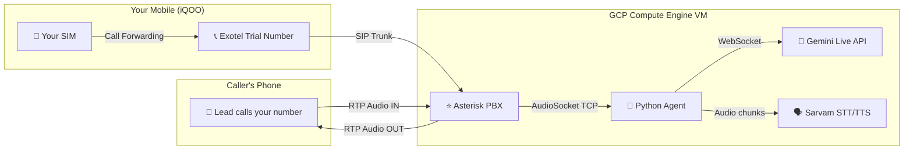
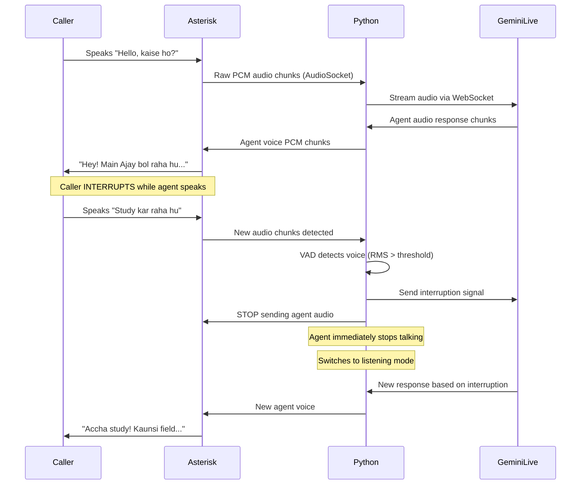

# 🏗️ Implementation Plan: VoIP-Based Live Voice Agent (GCP + Open Source Only)

## Goal

Build a production-grade, real-time voice agent with **Gemini Live / ChatGPT Voice-like behavior** — full-duplex listen, respond, and instant barge-in interruption — using only GCP resources and open-source software.

---

## Architecture



### How it works:

1. **Lead calls your regular phone number** (+91...)
2. Your phone **auto-forwards** the call to a virtual number (from Exotel free trial)
3. Exotel routes the call via **SIP trunk** to your **Asterisk server on GCP**
4. Asterisk answers and pipes the **raw bidirectional audio** to your Python agent via **AudioSocket** (TCP, 8kHz PCM)
5. Python agent streams caller's audio → **Gemini Live API** (or Sarvam STT → Gemini → Sarvam TTS)
6. Agent's response audio streams back → Asterisk → **directly into the caller's ear**
7. **Barge-in**: If caller speaks while agent is talking, VAD detects it → agent stops instantly

> [!IMPORTANT]  
> With this architecture, there is **zero Android security limitation** because the audio never touches the phone's hardware audio path. Everything flows through the SIP/RTP layer which gives us full software control over both directions.

---

## Components & Cost

| Component | Source | Cost |
|---|---|---|
| **Asterisk 21 PBX** | Open source (apt install) | ₹0 |
| **GCP Compute Engine** (e2-micro) | Your GCP account, free tier eligible | ₹0 |
| **Gemini Live API** | Your existing GCP/API key | ₹0 (free tier: 10 RPM) |
| **Sarvam STT/TTS** | Your existing API key | ₹0 (free tier) |
| **Python + AudioSocket** | Open source | ₹0 |
| **Phone Number (DID)** | See options below | See below |

### Phone Number Options (the ONE external piece)

> [!NOTE]
> To receive real PSTN phone calls on a VoIP server, you need at least ONE phone number connected to the telephone network. This is a physical infrastructure cost that no software can avoid — someone must pay the telco to bridge internet ↔ phone network.

| Option | Cost | Notes |
|---|---|---|
| **Exotel Free Trial** | ₹0 (₹500-1000 free credits) | 7-15 day trial, Indian number, requires KYC. **Best for testing.** |
| **Edesy.in SIP Trunk** | ~₹0.40/min | Cheapest Indian SIP trunk. Self-serve signup. |
| **Twilio Free Trial** | $0 ($15.50 free credits) | 30-day trial, US number only (not Indian). Good for API testing. |
| **Call Forwarding Trick** | ₹0 | Forward your mobile calls → any of the above numbers |

> [!TIP]
> **Recommended path**: Sign up for **Exotel free trial** (you already explored this in the earlier conversation). Get a free ExoPhone number. Forward your mobile calls to it. Zero cost for development & testing.

---

## Detailed Architecture: How Barge-In Works

This is the exact same architecture used by Gemini Live and ChatGPT Voice, adapted for phone calls:



### Key Differences from Our On-Device Approach

| Feature | On-Device (Shizuku) | VoIP (Asterisk) |
|---|---|---|
| Capture caller voice | ✅ Works via Shizuku | ✅ Works natively via RTP |
| Send agent voice to caller | ❌ IMPOSSIBLE (hardware block) | ✅ Works natively via RTP |
| Barge-in interruption | ⚠️ Hacky (RMS-based) | ✅ Clean (server-side VAD) |
| Latency | ~2-3 sec (STT→LLM→TTS) | ~500ms (Gemini Live speech-to-speech) |
| Android dependency | Yes (Shizuku, foreground service) | No (phone just forwards calls) |

---

## Implementation Steps

### Phase 1: GCP VM + Asterisk Setup
```
1. Create GCP Compute Engine VM (e2-small, Ubuntu 22.04)
2. Install Asterisk 21 (apt install asterisk)
3. Configure SIP trunk (pjsip.conf) for Exotel/provider
4. Configure dialplan (extensions.conf) with AudioSocket
5. Open firewall ports: 5060 (SIP), 10000-20000 (RTP)
```

### Phase 2: Python AudioSocket Agent
```
1. Build TCP server that speaks Asterisk AudioSocket protocol
2. Receive 8kHz 16-bit PCM from Asterisk (caller's voice)
3. Stream to Gemini Live API via WebSocket
4. Receive Gemini's audio response
5. Send back to Asterisk (plays into caller's ear)
6. Implement VAD for barge-in interruption
```

### Phase 3: Call Forwarding + Testing
```
1. Get Exotel trial number (or any SIP DID)
2. Configure Exotel to route calls to your Asterisk VM via SIP
3. Set conditional call forwarding on your mobile:
   - Dial **21*EXOTEL_NUMBER# (forward all calls)
   - Or **61*EXOTEL_NUMBER# (forward when unanswered)
4. Test: Call your mobile from another phone → auto-forwards → agent answers
```

### Phase 4: Agent Brain (Choose One)

#### Option A: Gemini Live API (Recommended — lowest latency)
- Native speech-to-speech, no separate STT/TTS needed
- Built-in VAD and barge-in handling
- ~500ms response latency
- Use `gemini-3.1-flash-live-preview` model

#### Option B: Sarvam STT → Gemini → Sarvam TTS (Current pipeline)
- Uses your existing code from `core/pipeline.py`
- Higher latency (~2-3 seconds) due to cascade
- More control over each component
- Already built and tested

---

## What We Keep from the Current Codebase

| Component | Status |
|---|---|
| `core/agent.py` (Gemini agent brain) | ✅ Keep as-is |
| `core/prompts.py` (system prompt + KB) | ✅ Keep as-is |
| `core/stt.py` (Sarvam STT) | ✅ Keep (Option B) |
| `core/tts.py` (Sarvam TTS) | ✅ Keep (Option B) |
| `core/pipeline.py` (orchestrator) | 🔄 Refactor for AudioSocket input/output |
| `db/database.py` (MongoDB logging) | ✅ Keep as-is |
| `termux_agent.py` | 🔄 Replace with `asterisk_agent.py` |
| Android AudioBridge app | ❌ No longer needed (phone just forwards calls) |

---

## Open Questions

> [!IMPORTANT]
> 1. **Exotel vs new provider**: You explored Exotel before. Want to use their free trial, or try a different SIP provider?
> 2. **Gemini Live API vs current STT→LLM→TTS cascade**: Gemini Live gives ~500ms latency but less control. Current pipeline gives more control but ~2-3s latency. Which do you prefer?
> 3. **Call forwarding scope**: Forward ALL calls to the agent, or only when you don't answer (conditional forwarding)?
