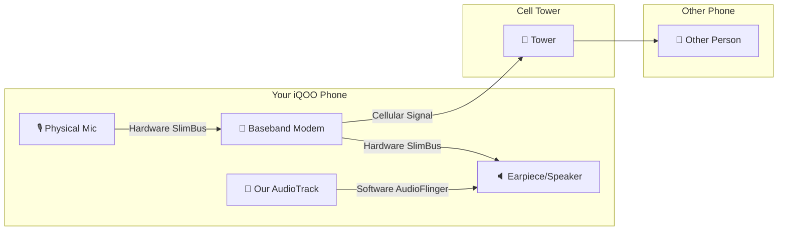
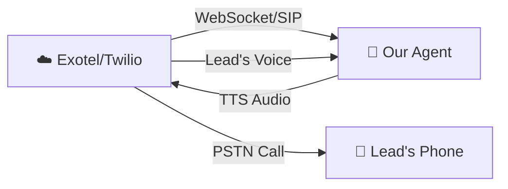

# 🔬 Deep Research: Why TTS Audio Doesn't Reach the Other Caller

## The Core Problem

When we play audio via `AudioTrack` with `STREAM_VOICE_CALL`, it plays through the **local earpiece/speaker** of the iQOO device. The person on the other end of the phone call **cannot hear it**. This is not a bug in our code — it is a **fundamental hardware-level limitation of Android**.

## How Android Phone Call Audio Actually Works

> [!CAUTION]
> **The microphone → modem path is HARDWARE-LEVEL (SlimBus/I2S bus).** It completely bypasses the Android audio framework (AudioFlinger). No app — not even with Shizuku shell privileges — can inject audio into this path. Our `AudioTrack` output goes to the earpiece speaker, NOT into the modem's TX stream.

## What We Confirmed Through Research

| Approach | Can inject into call TX? | Notes |
|---|---|---|
| `AudioTrack` + `STREAM_VOICE_CALL` | ❌ No | Plays locally through earpiece/speaker only |
| Shizuku (shell UID 2000) | ❌ No | Shell cannot access kernel/hardware audio routing |
| `MODIFY_AUDIO_ROUTING` permission | ❌ No | Managed by role, cannot be granted via ADB |
| `setCommunicationDevice()` | ❌ No | Changes local output device, doesn't inject into TX |
| `tinymix` / ALSA controls | ❌ No | Requires root; shell user denied access to `/dev/snd/` |
| `InCallService` API | ❌ No | Provides call metadata only, no audio stream access |
| Root + custom kernel module | ✅ Yes | But requires rooting the device |

## Three Realistic Options

### Option A: 🔊 Speakerphone Loopback (Hacky, works today)

Force speakerphone mode + play TTS through speaker → mic picks it up → modem transmits it.

**Pros:**
- Works immediately, no external services needed
- No root required

**Cons:**
- **Terrible audio quality** — echo, ambient noise, distortion
- Android's AEC (Acoustic Echo Cancellation) will actively try to CANCEL our TTS from the mic stream
- Not suitable for production/professional use
- User will hear the TTS from the speaker too (no privacy)

---

### Option B: 📞 VoIP Service (Proper solution — Exotel/Twilio)

Instead of using the cellular call path, route calls through a **VoIP service** where we control the entire audio pipeline in software.

**Pros:**
- Full control over both TX and RX audio streams
- Professional call quality
- Works from any server (cloud, local, phone)
- This is how ALL production AI calling agents work (Bland.ai, Retell.ai, Vapi, etc.)

**Cons:**
- Requires paid VoIP service (Exotel starts ~₹1/min for Indian numbers)
- Needs internet connection for the agent

> [!IMPORTANT]
> This is how we originally designed AgentLine with Exotel in the first conversation. The on-device approach was an attempt to avoid per-call costs, but the Android security model makes it impossible to fully replace VoIP for bidirectional call audio.

---

### Option C: 🎧 Hardware Audio Adapter (Physical workaround)

Use a TRRS audio splitter/mixer that presents itself as a headset to the phone. The external device injects TTS audio into the "microphone" line of the headset jack.

**Pros:**
- Clean audio, bypasses Android restrictions completely
- No root needed

**Cons:**
- Requires buying specific hardware (~₹500-2000)
- Physical setup, not scalable
- iQOO may not have a 3.5mm jack (needs USB-C adapter)

---

## Recommendation

> [!TIP]
> **Option B (VoIP/Exotel) is the only production-viable path.** Every commercial AI calling platform (Bland, Retell, Vapi, Bolna) uses VoIP because cellular call audio injection is impossible on modern phones.
> 
> However, the **capture side (hearing what the caller says) works perfectly** via our Shizuku approach. If you want, we can use a **hybrid approach**: use Exotel/Twilio to PLACE the call (giving us TX audio control), while keeping the on-device Shizuku capture as a fallback or for recording purposes.

## What Still Works Perfectly ✅

- **Capturing caller's voice** via Shizuku + AudioRecord(VOICE_CALL) → STT → Gemini → response generation
- **Call detection** via PhoneStateReceiver (inbound/outbound direction tracking)
- **Full-duplex barge-in** via RMS-based VAD
- **The entire agent brain** (STT → Gemini → TTS pipeline)

The ONLY missing piece is getting the TTS audio bytes into the call's TX stream, which requires VoIP.
